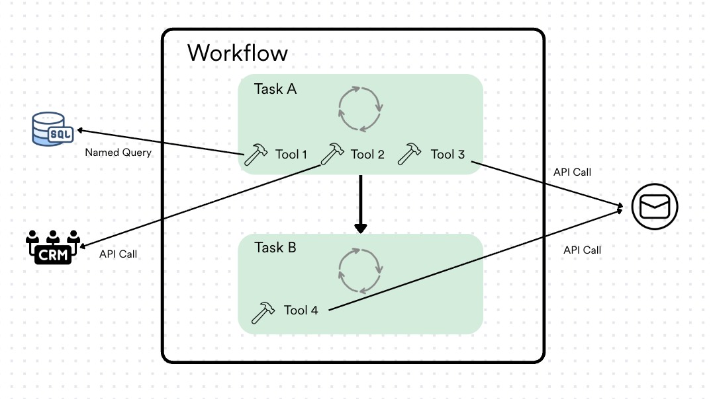
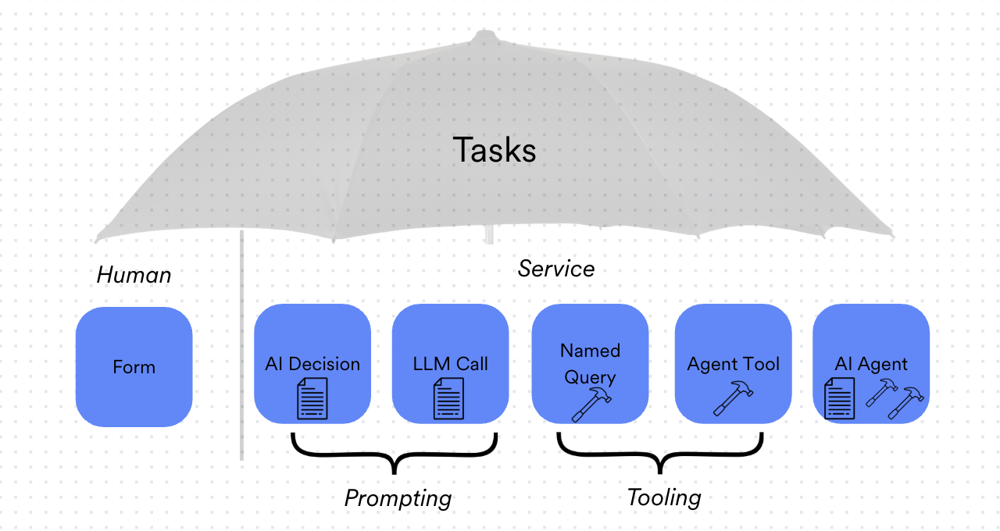
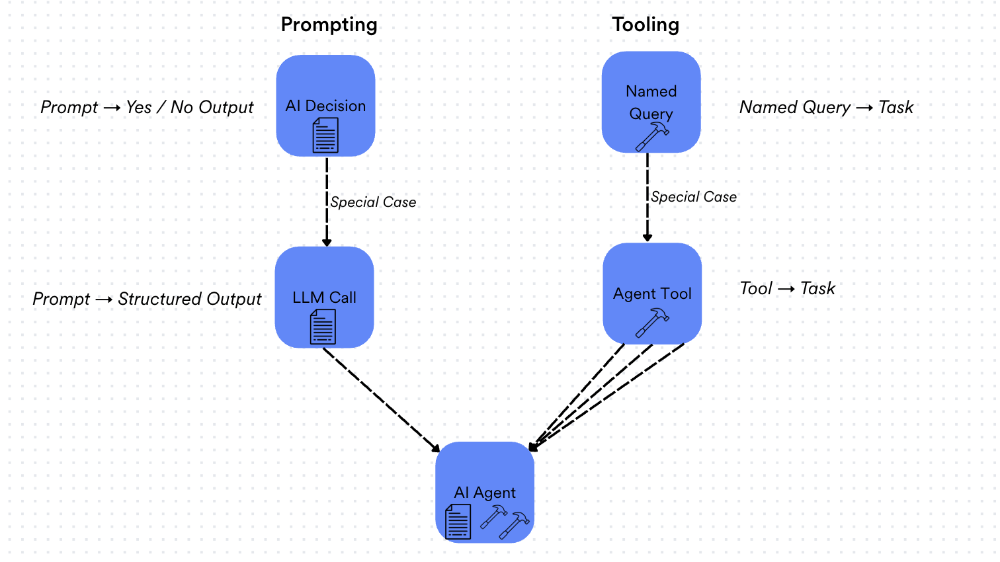
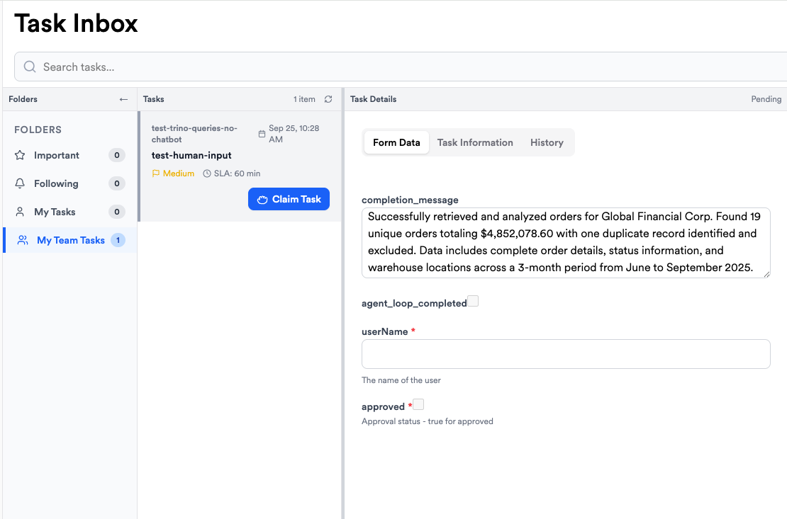

## Overview

### Entity Dictionary
We will use a top-down approach to review the entities which make up ContextOne.

#### 1 Workflow
A workflow is a general end-to-end process, comprised of one or more tasks, in order to achieve a given function or purpose within or by ContextOne. More often than not, a user will be creating workflow(s) by first creating all the necessary components (i.e. tasks, tools, prompts, schemas) and weaving them together to form a complete process. However, there are also subtle workflows that are defined by the system with which the user may interact without necessarily realizing they are interacting with a workflow (e.g Structured Query Builder, Chat, etc.)
<p align="center">
  
  <em>Workflow Diagram</em>
</p>

#### 2 Task 
A task is a unit / top-level item within a workflow. Tasks connect to each other with inputs/outputs. All tasks have 0 or 1 input schemas, and 1 or more output schemas. Different output schemas usual reflect different task results, for example, a BookFlight task might have a BookFlightSuccess schema with confirmation number, flight time, and seat, and BookFlightFailed schema might have an errorMessage / failureCode. If necessary, mappings  can be applied between tasks to convert the output of one task to match the expected input of the subsequent tasl. All tasks also have a name/description.

**Task Types**:
1. **Human Task**
2. **AI Agent Task** (may want to rename to _AI Agent Loop YTask_)
3. **Gateway Agent Task** (may want to rename to _Tool Task_)
4. **LLM Call Task**
5. **AI Decision Task**

<p align="center">
  
  <em>Task Umbrella (i.e. how do these tasks appear in the platform?)</em>
</p>
<p align="center">
  
  <em>Task Hierarchy (i.e. how are these tasks truly related?)</em>
</p>

##### 2.1 Human Tasks
Human tasks have the following properties: 
- **Routing Group** (e.g, Admin, QA, Users)
- **Routing Strategy** (e.g. Round Robin, Broadcast)
- **Priority** (Medium, High) and SLA (number)

If a workflow triggers a human task, they appear in the task inbox as below. This page needs some work - the previous task had an output schema “completion_message” and “agent_loop_completed” - these should appear as read-only. The Human Task at hand, “test-human-output” has outputs of userName (string) and approved (boolean).

<p align="center">
  
  <em>Task Inbox Example</em>
</p>

##### 2.2 AI Agent Task
AI Agent Tasks are the latest innovation both at AI One and in the field of AI. The concept is that you have created an AI Agent, that has context available to it (files, inputs) and tools available to it, and prompts that instruct it (often on how and when to use its tools). Let's go through fields/components one by one, **(entity)** would indicate the component has the importance that it is its own entity in the system with its own widget / discovery.

1. **Context Configuration** - but it is a parameter that tells the loop if it includes all of the previous workflow context, the previous tasks context, or no previous context (None, All, Selective)
2. **Input / Output Schemas (entity - schema)** - described above
3. **Agent Loop Name** - just a name / string
4. **Max Iterations** - number - max iterations the loop will run on, typically 10-50
5. **Agent Loop Model Tag** (**entity - model tag)** - AI Model Tag responsible for running coordinating the loop
6. **System Prompt (entity - prompt**) the prompt that tells the system its job. E.g. “You are an expert a booking flights with TAU Airline’s System, using the tools provided to you”.  These are actually typically quite, quite lengthy to fully explain to the Agent how it should behave.
7. **User Prompt (entity - prompt)** the prompt of a request to the loop, e.g., “Book me a flight to London”.
8. **Tools (entity - tool)** - the tools the agent can call. E.g., Book a Flight, Search Flights, Create Customer Support Ticket, Send and Email.
9. **Context Files** **(entity - file)** - simply files that have been uploaded the system that are included in the Agents context. For example, a PDF explaining things.
10. **AI Policies** **(entity)** optional - policies are new way to interact with AI outside of prompts, which apply guardrails and may want to be re-used in different tasks.  For example, never call Book Flight tool if the flight cost is over $1,000, instead tell the user they must book on the website.
11. **Adjudicator Configuration** (optional / related to policies) - Adjudicator is used specifically for AI making decisions.  See **AI Decision Task** type.  This feature of the agent loop equips it to evaluate policies. *Shaun more familiar with what this means*.
12. **Minimum Confidence Score**
13. **Adjudicator Model Tag (entity - model tag)** - a different model tag, used 
14. **Adjudicator System Prompt (entity - prompt)** - prompt used for adjudicator
15. **Adjudicator User Prompt (entity - prompt)** - prompt used for adjudicator

##### 2.3 Gateway Agent Task
This is simply a wrapper task around a Gateway tool. Aside from standard properties (name/description/input/output schemas) the only property of a Gateway Agent task is exactly one Tool. When the workflow reaches a Gateway Agent Task, it simply executes the tool (there is no AI involved determining if the tool should be executed or not).

##### 2.4 LLM Call Task
This is simply a singular call to an LLM. Unlike the Agent Loop, this runs just once, does not have tools available, etc. It has the following properties (in addition to name/description/input/output schemas)

1. **Model Tag (entity)**
2. **Confidence Threshold** - number 0-1
3. **Fallback Executor** - Human or Service
4. **Max Retries** - number
5. **Policies** **(entity)** same as agent loop
6. **System Prompt (entity)**
7. **User Prompt (entity)**
8. **Enable File Upload** - toggle true/false
9. **File Upload Configuration** (when enabled file upload is true)
10. **Maximum File Size** - e.g. 10.0 MB
11. **Maximum Number of Fils** - e.g. 2
12. **Allowed File Types** - e.g. PDF, PNG, DOCX
13. **Initial Context Files** - same as AI Agent Loop

##### 2.5 AI Decision Task
This is a single LLM Call as well, but used to decide a yes/no answer.

It has all the same properties as LLM Call Task, except no enable file upload or file upload configuration.

#### 3 Tools
Tools are self-contained processes that can be invoked within a workflow. There are currently four types of tools, and depending on their purpose, they can be invoked in two distinct ways. Three of the four types of tools are deterministic in nature, one type allows for probabilistic / non-deterministic handling.

##### 3.1 Types of Tools
###### 3.1.1 Platform / System Tools
These are deterministic tools which are coded, registered, and handled by the platform (often integral or foundational tools that are used for many general purposes). Examples include **markt_task_complete**, **read_scratch_pad**, **write_scratch_pad**, **request_human_input** which are all used within AI Agent tasks in order to ensure process progression is correctly handled. 

###### 3.1.2 Named Queries
SQL queries built by users using the structured query agent (i.e directly within the platform's UI) can be saved as **Named Queries**, which the user can subsequently expose as a tool. This effectively allows the user to expose this as a task or enable an AI Agent task to call this tool within its processing. Though Named Queries are built using LLM calls, they are deterministic SQL calls once they have been saved. 

###### 3.1.3 Gateway Agent Tools
Gateways and Agents serve to register tools (often through API calls) to third party services (e.g. Notion, Slack, Google Workspace). These tools are coded and registered within the relevant gateway. Once registered, the user may then expose these tools to make them available as standalone tasks or to be called within an AI Agent task. These tools provide deterministic third-party interactions (e.g. send _this_ email, update _this_ CRM entry, read the recent history of _this_ Slack channel, where _this_ represents the input to the tool call).

###### 3.1.4 AI Agent Tools
AI Agent tools represent the only _non-deterministic_ tool call and were developed in order to organize and replicate foundational AI Agent tasks. Consider a complicated AI Agent (i.e. it's system and/or user prompt requires lengthy explanation). If there is a step within that AI Agent that is both
- Complex enough to require both prompting and tooling (i.e. it must be handled by an AI Agent)
_and_
- Fundamental enough to be often re-used within the same AI Agent or across multiple AI Agents
then this step should be an AI Agent tool. 
**Example**: Consider the example of querying a Notion database. Querying a Notion database using the tools available via Notion's API (and thus the tools that are exposed in Notion Gateway) requires three sequential tool calls. However, the input to these tool calls greatly depends on the desire of the user. Thus, a Notion database query requires both tool calls and tight system prompting to guide the Agent on how to use these tool calls. _Yet_, any useful Notion workflow will likely require multiple queries. So rather than clogging up the system prompt of the outer workflow, we should create an AI Agent tool and expose this to the outer workflow. 

##### 3.2 Ways to Invoke Tools
###### 3.2.1 Tools as Tasks
Tools can be directly exposed as tasks. This facilitates having a task within a workflow that only executes a single tool call (e.g. at the end of a workflow I always want an update emailed to me as a status report of the workflow -> use a Gateway Agent tool with my email service gatewat).

**Note**: This type of invocation only makes sense with Named Queries and Gateway Agent tools. 
- Platform / system tools are designed to be used within AI Agents and thus don't make sense as stand alone tools.
- AI Agent tools begin as standalone tasks, and thus it becomes cyclical to create a task which wraps a tool whose only job is to invoke an existing task. Just use the existing task. 

###### 3.2.2 Tools within Tasks
The more interesting method is to use tools within tasks (specifically within AI Agent tasks). When creating an AI Agent, the user may configure exactly which tools the agent has available (to essentially use at whenever it deems necessary within certain guardrails / policies). This allows the AI Agent to delegate process handling to a contained, single-purpose process that is useful within the broader execution of the task.
- **Platform / System Tools**: These tools are fundamental tools which are either necessary or very useful for the completion of all AI Agent loop tasks. Some of these tools are optional, others are required.
- **Named Queries & Gateway Agents**: These optional tools enable the AI Agent to execute some deterministic, pre-defined process using the data relevant to the task.
- **AI Agents**: These optional tools enable an AI Agent to delegate a "sub-task" to another, more focused AI Agent. These hierarchical AI Agents faciliate simplified, re-usable AI Agents. 

#### 4 Prompts
There are four prompt types
- System Prompt
- User Prompt
- Adjudicator System Prompt
- Adjudicator User Pompt.
Prompts also have a version, and optionally, the ability to have different text for different AI models (not a priority in designs now).
- E.g., you might make a prompt for a specific purpose, e.g., “flight-booking-prompt”. This prompt gives an Agent Loop all the details it needs to understand how to book a flight. You will always have a default text, but you might also have different text for different models - e.g., OpenAI might respond better to different words in a prompt, so if you are using Anthropic, you use the default, but if you are using OpenAI, you would sub out for the specific model prompt
We discussed prompt actions from within a task builder:
- Create New
- Edit
    - On save, can say:
        - Save as New Prompt
        - Save and apply new version to this task
        - Save and apply new version for all tasks (this will affect X tasks)

##### 5 Recipes
Recipes are reusable data transformation templates that act as a bridge between business questions and executable data operations. They represent a specific class of context management used exclusively by the structured query agent. Think of them like cooking recipes, but for data transformations: each one defines what to do, how to do it, and when it's appropriate to use. In essence: Recipes are the platform's way of making data transformations discoverable, reusable, and semantically searchable—allowing users to find the right transformation for their business question without needing to know SQL or where the data lives.

A recipe encapsulates:
- Business Purpose: What business problem it solves
- Transformation Logic: SQL/Alteryx/Python code with parameters
- Semantic Context: Keywords and example questions to help match it to user needs
- Workflow Integration: How it fits into broader business processes

###### 5.1 Architecture
1. RecipeContract (Single Source of Truth)
- This Java contract defines the complete structure with fields like:
    - Identification: recipeId, recipeName (e.g., filter_active_insurance_policies)
    - Business Context: 25-word summary, category, semantic keywords, example questions
    - Discovery Hints: Primary entities, time granularity, typical filters, output type
    - Transformation: Code template with parameterized placeholders (${status}, ${start_date})
    - Workflow Context: Common precursor/followup recipes, documentation references

2. Recipe Agent (Generation Engine)
- A Python agent that:
    - Reads Excel files (containing transformation examples) + PDF documentation (business context)
    - Sends each transformation + context to the LLM Gateway
    - Gets back fully-populated RecipeContract JSON
    - Persists recipes to S3/MinIO storage
Example flow: Excel cell with SQL → LLM analyzes → Generates RecipeContract → Stored in S3

3. UI Integration (RecipeService)
- Provides operations like:
    - fetchRecipes() - Retrieve from S3
    - filterRecipes() - Search by keywords
    - filterRecipesByCategory() - Filter by business domain
    - validateRecipe() - Schema validation

4. Query Agent Integration
- Uses recipes for semantic matching:
    - User asks: "Which customers have active policies?"
    - Agent searches recipes by keywords, business questions, and patterns
    - Returns matching recipes with reasoning
    - Populates parameters and executes transformation

##### 5.2 Key Features
1. **Parameter Substitution**
- Templates use placeholders:
```
SELECT * FROM policies
    WHERE status = ${status}
    AND effective_date >= ${start_date}
```
- Users provide values → Template populated → Query executed

2. **Semantic Discovery**
- Each recipe includes:
    - Keywords: `["policy", "coverage", "active", "renewal"]`
    - Example Questions: `["Which customers have active policies?", "What is our monthly premium revenue?"]`
    - Query Patterns: Templates like `"Show me {entity} for {time_period}"`

3. **Categories**
- Nine business domains:
    - Financial, Customer, Inventory, Operations, Sales, Marketing, HR, Reporting, General

4. **Workflow Context**
- Recipes know their place in workflows:
    - Common precursor recipes (run before)
    - Common follow-up recipes (run after)
    - Links to decision context and documentation

##### 5.3 Lifecycle
1. Excel + PDF Input
    ↓
2. Recipe Agent processes → sends to LLM Gateway
    ↓
3. LLM generates RecipeContract JSON
    ↓
4. Stored in S3 with metadata
    ↓
5. Retrieved by Structured Query Agent for matching
    ↓
6. UI displays and allows filtering/searching
    ↓
7. User selects → Parameters filled → Transformation executed
